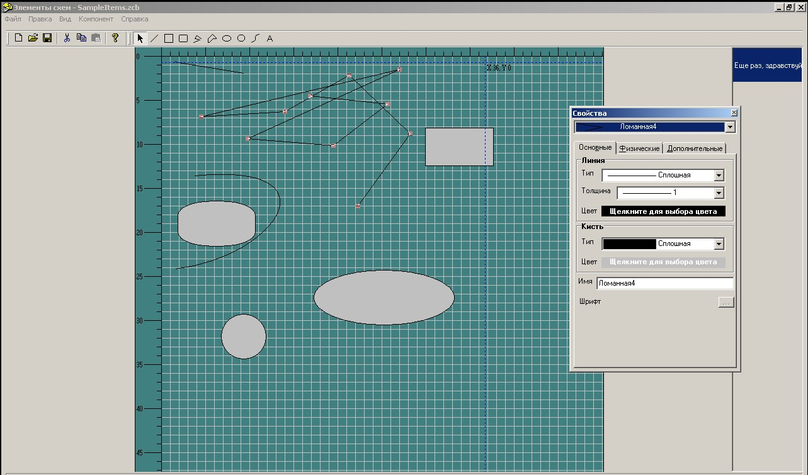
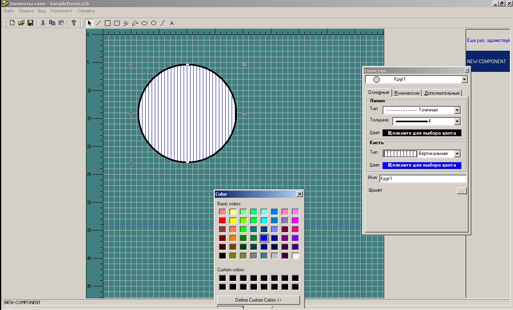
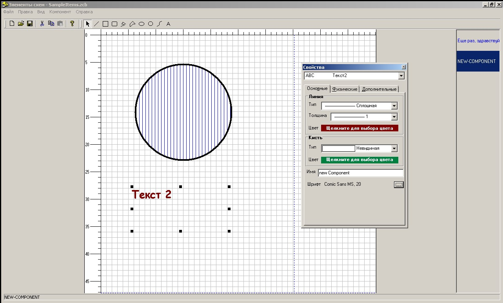

# Win32GraphDelphi
Win32 API for vector graphics.

Delphi 5.0, Win32 API (2000 year)

Russian:
Утилита была создана как часть проекта для проектирования тепловых сетей. Утилита работает с векторной графикой,
позволяет создавать компоненты наделенные свойствами. Компоненты создаются из графических примитивов Windows: линия, 
кривая Безье, окружность и т.п.

